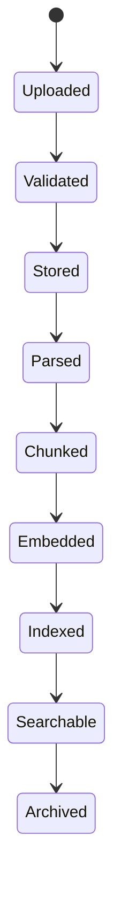

# 15. AI Document Processing Pipeline

## 15.1 Overview

The Document Processing Pipeline converts uploaded procurement documents into structured, searchable, and AI-ready knowledge.

Every uploaded document passes through a standardized processing pipeline before becoming available to the AI subsystem.

This pipeline ensures:

* Secure file handling
* Text extraction
* Metadata generation
* Chunk generation
* Embedding creation
* Vector indexing
* Search optimization

---

# 15.2 Objectives

The pipeline is designed to:

* Support multiple document formats.
* Preserve document structure.
* Extract metadata.
* Prepare documents for Retrieval-Augmented Generation (RAG).
* Enable semantic search.
* Improve AI response quality.
* Maintain document version history.

---

# 15.3 Supported File Formats

| Category     | Supported Formats        |
| ------------ | ------------------------ |
| Documents    | PDF, DOCX, TXT, Markdown |
| Spreadsheets | XLSX, CSV                |
| Images       | PNG, JPG, JPEG, TIFF     |
| Future       | PPTX, HTML               |

---

# 15.4 Processing Architecture

```mermaid
flowchart LR

Upload

↓

Validation

↓

Virus Scan

↓

Storage

↓

Parser

↓

Metadata Extraction

↓

OCR (Optional)

↓

Chunking

↓

Embedding

↓

Vector Database

↓

Ready For AI
```

---

# 15.5 Upload Service

Responsibilities

* Receive uploaded file.
* Validate MIME type.
* Validate file size.
* Generate file identifier.
* Store original file.
* Trigger background processing.

---

# 15.6 File Validation

Validation includes:

* Allowed MIME type
* File extension
* Maximum size
* Malware scan
* Duplicate detection
* Empty file detection

Rejected files are deleted immediately.

---

# 15.7 Storage Layer

Development

```text
Local Storage
```

Production

```text
Cloudinary

or

Amazon S3
```

Original documents are never modified after upload.

---

# 15.8 Metadata Extraction

Extracted metadata includes:

* File Name
* Original Name
* File Extension
* MIME Type
* File Size
* Upload Date
* Uploaded By
* Organization ID
* Language
* Page Count
* Version

Metadata is stored in PostgreSQL.

---

# 15.9 Document Parsing

Each file type uses a dedicated parser.

| File Type | Parser        |
| --------- | ------------- |
| PDF       | pdf-parse     |
| DOCX      | mammoth       |
| XLSX      | exceljs       |
| CSV       | csv-parser    |
| TXT       | Native Reader |
| Markdown  | remark        |

The parser extracts structured text while preserving headings and document hierarchy whenever possible.

---

# 15.10 OCR Processing

Images and scanned PDFs require OCR.

Supported files

* PNG
* JPG
* TIFF
* Scanned PDF

OCR extracts:

* Text
* Tables
* Numbers
* Headers

Future enhancement

* Multi-language OCR
* Handwriting recognition

---

# 15.11 Text Normalization

Before chunking, extracted text is normalized.

Operations include:

* Remove duplicate whitespace.
* Normalize line breaks.
* Preserve headings.
* Preserve numbered lists.
* Preserve tables where possible.
* Remove invisible characters.

---

# 15.12 Document Classification

The system classifies uploaded documents.

Examples

* RFP
* Proposal
* Vendor Profile
* Contract
* Invoice
* Procurement Policy
* Technical Specification
* Compliance Document

Classification improves retrieval quality.

---

# 15.13 Chunk Generation

Documents are divided into logical chunks.

Preferred strategy

* Recursive chunking

Fallback

* Fixed token chunking

Each chunk stores:

* Chunk ID
* Parent Document
* Section
* Page Number
* Token Count
* Position

---

# 15.14 Embedding Generation

Each chunk is converted into an embedding.

Pipeline

```mermaid
flowchart LR

Chunk

↓

Embedding Provider

↓

Vector

↓

Qdrant
```

Embedding generation runs asynchronously.

---

# 15.15 Vector Indexing

Each embedding is stored with metadata.

Stored metadata

* Organization ID
* Document ID
* Chunk ID
* Category
* Language
* Version
* Source File

Metadata enables efficient filtering during retrieval.

---

# 15.16 Version Management

Every uploaded document maintains version history.

Example

```text
Vendor_Profile.pdf

Version 1

↓

Version 2

↓

Version 3
```

Old versions remain searchable if enabled by organization policy.

---

# 15.17 Background Processing

Long-running operations execute asynchronously.

Examples

* OCR
* Embedding generation
* AI summarization
* Large document parsing
* Vector indexing

The upload API should return immediately while processing continues in the background.

---

# 15.18 Document Lifecycle



---

# 15.19 Error Handling

Possible failures

* Unsupported format
* Corrupted document
* OCR failure
* Embedding failure
* Vector indexing failure
* Storage failure

Failed documents receive a processing status and detailed logs for troubleshooting.

---

# 15.20 Processing Status

Each document has a processing status.

Possible values

* Uploaded
* Validating
* Processing
* Chunking
* Embedding
* Indexed
* Completed
* Failed

The frontend can display progress using these states.

---

# 15.21 Security

The processing pipeline enforces:

* Organization isolation
* Access control
* Virus scanning
* Secure storage
* Metadata validation
* Temporary file cleanup

Temporary processing files are deleted after successful indexing.

---

# 15.22 Performance Optimization

Optimization techniques

* Parallel parsing
* Background workers
* Batch embedding generation
* Incremental indexing
* Cached metadata
* Lazy loading
* Compression for large documents

---

# 15.23 Processing Metrics

Metrics collected

* Upload Time
* Parsing Time
* OCR Time
* Chunk Count
* Embedding Time
* Indexing Time
* Total Processing Time
* Processing Status

These metrics support monitoring and optimization.

---

# 15.24 Directory Structure

```text
src/

ai/

├── parsers/
│   ├── pdf.parser.js
│   ├── docx.parser.js
│   ├── excel.parser.js
│   ├── csv.parser.js
│   ├── markdown.parser.js
│   └── image.parser.js
│
├── loaders/
│
├── chunking/
│
├── embeddings/
│
└── pipelines/
    └── document.pipeline.js
```

---

# 15.25 Complete Processing Flow

```mermaid
flowchart TB

Upload

↓

Validate

↓

Store Original File

↓

Extract Metadata

↓

Parse Document

↓

OCR (If Required)

↓

Normalize Text

↓

Generate Chunks

↓

Generate Embeddings

↓

Store in Qdrant

↓

Save Metadata

↓

Ready for AI Search
```

---

# 15.26 Summary

The Document Processing Pipeline transforms uploaded procurement documents into AI-ready knowledge through validation, parsing, OCR, metadata extraction, chunk generation, embedding creation, and vector indexing. By separating document processing into modular stages and executing computationally intensive tasks asynchronously, BidSense provides a scalable foundation for semantic search, Retrieval-Augmented Generation (RAG), compliance analysis, and intelligent procurement assistance.
