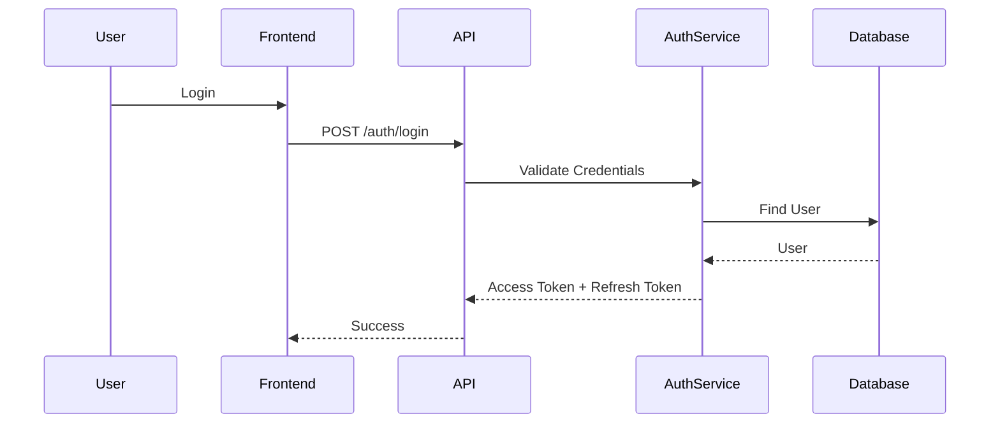

# 11. Authentication & Authorization Architecture

## 11.1 Overview

Authentication and Authorization are fundamental security components of the BidSense platform.

The authentication system verifies a user's identity, while the authorization system determines which resources and operations the authenticated user can access.

The architecture is designed to provide:

* Secure Authentication
* Stateless Authorization
* Multi-Tenant Isolation
* Role-Based Access Control (RBAC)
* Refresh Token Management
* Email Verification
* OTP Verification
* Session Management
* Audit Logging

---

# 11.2 Authentication Architecture

```mermaid
flowchart TB

User

↓

Register

↓

Email Verification

↓

Login

↓

JWT Access Token

↓

Refresh Token

↓

Protected APIs

↓

Logout
```

---

# 11.3 Authentication Components

The authentication module consists of:

```text
Authentication Module

├── Auth Routes

├── Auth Controller

├── Auth Service

├── Auth Repository

├── Auth Validator

├── Auth Middleware

├── Token Service

├── OTP Service

├── Mail Service

└── JWT Utility
```

---

# 11.4 Authentication Flow



---

# 11.5 Registration Flow

```mermaid
flowchart LR

Register

↓

Validate Input

↓

Hash Password

↓

Create User

↓

Generate OTP

↓

Send Email

↓

Verify Email

↓

Activate Account
```

---

# 11.6 Login Flow

Steps:

1. Validate request.
2. Find user by email.
3. Verify password.
4. Check account status.
5. Generate Access Token.
6. Generate Refresh Token.
7. Store hashed Refresh Token.
8. Return authenticated user.

---

# 11.7 Logout Flow

```mermaid
flowchart TB

Logout

↓

Delete Refresh Token

↓

Clear Cookie

↓

Audit Log

↓

Success
```

---

# 11.8 Password Reset Flow

```mermaid
flowchart LR

Forgot Password

↓

Generate OTP

↓

Email OTP

↓

Verify OTP

↓

New Password

↓

Hash Password

↓

Update Database

↓

Success
```

---

# 11.9 Email Verification Flow

```mermaid
flowchart LR

Registration

↓

Generate OTP

↓

Email

↓

Verify OTP

↓

Account Verified
```

---

# 11.10 JWT Architecture

BidSense uses two-token authentication.

## Access Token

Purpose

* Authenticate API requests.

Characteristics

* Short lifetime
* Stateless
* Sent in Authorization header

Example

```text
Authorization: Bearer <access_token>
```

---

## Refresh Token

Purpose

Generate a new Access Token without requiring the user to log in again.

Characteristics

* Long lifetime
* Stored as HttpOnly cookie
* Saved in database as a hash
* Revocable

---

# 11.11 Token Lifecycle

```mermaid
flowchart TB

Login

↓

Access Token

↓

API Requests

↓

Expired

↓

Refresh Token

↓

New Access Token
```

---

# 11.12 Session Management

Each login creates a session.

Session information includes:

* User ID
* Device
* Browser
* IP Address
* Login Time
* Refresh Token Hash
* Expiration Time

Users can revoke:

* Current Session
* All Sessions

---

# 11.13 Password Security

Passwords are never stored in plain text.

Process

```text
Password

↓

bcrypt Hash

↓

Database
```

Requirements

* Minimum length
* Complexity validation
* Secure hashing
* Password change history (future)

---

# 11.14 OTP System

OTP Types

* Email Verification
* Password Reset
* Account Recovery

OTP Rules

* Numeric code
* Time-limited
* Single use
* Automatically expires
* Maximum retry limit

Redis stores temporary OTP values.

---

# 11.15 Role-Based Access Control (RBAC)

Supported Roles

* Super Admin
* Organization Admin
* Procurement Manager
* Procurement Officer
* Vendor
* Viewer

---

# 11.16 Permission Model

Permissions are resource-based.

Examples

```text
vendor.create

vendor.read

vendor.update

vendor.delete

rfp.create

rfp.publish

proposal.review

payment.manage

organization.manage
```

Authorization middleware verifies permissions before executing protected endpoints.

---

# 11.17 Authorization Flow

```mermaid
flowchart LR

Request

↓

JWT Validation

↓

Extract User

↓

Load Permissions

↓

Permission Check

↓

Allow / Deny
```

---

# 11.18 Multi-Tenant Authorization

Every request is scoped to an organization.

Rules

* Users can only access data belonging to their organization.
* Organization Admins manage only their organization.
* Vendors cannot access internal procurement data.
* Super Admin has platform-wide access.

Organization filtering is enforced in repository queries.

---

# 11.19 Authentication Middleware

Responsibilities

* Validate JWT
* Load user
* Attach user to request
* Reject invalid tokens

Controllers never validate JWTs directly.

---

# 11.20 Authorization Middleware

Responsibilities

* Verify required permissions
* Verify organization ownership
* Verify role access
* Return HTTP 403 for unauthorized operations

---

# 11.21 Security Best Practices

Authentication security includes:

* HttpOnly Refresh Cookies
* Secure Cookies
* SameSite Protection
* Password Hashing
* Token Expiration
* Token Rotation
* Refresh Token Revocation
* Rate Limiting
* Login Attempt Monitoring
* Audit Logging

---

# 11.22 Authentication Database Tables

Authentication uses the following tables:

```text
users

roles

permissions

refresh_tokens

otp_codes

audit_logs
```

---

# 11.23 Authentication APIs

| Method | Endpoint                     | Description                |
| ------ | ---------------------------- | -------------------------- |
| POST   | /api/v1/auth/register        | Register user              |
| POST   | /api/v1/auth/verify-email    | Verify email               |
| POST   | /api/v1/auth/login           | Login                      |
| POST   | /api/v1/auth/refresh-token   | Refresh access token       |
| POST   | /api/v1/auth/logout          | Logout                     |
| POST   | /api/v1/auth/forgot-password | Request password reset     |
| POST   | /api/v1/auth/verify-otp      | Verify OTP                 |
| POST   | /api/v1/auth/reset-password  | Reset password             |
| GET    | /api/v1/auth/me              | Current authenticated user |

---

# 11.24 Error Handling

Authentication responses use consistent status codes.

| Status | Meaning               |
| ------ | --------------------- |
| 200    | Success               |
| 201    | User Created          |
| 400    | Validation Error      |
| 401    | Authentication Failed |
| 403    | Authorization Failed  |
| 404    | User Not Found        |
| 409    | Duplicate Email       |
| 429    | Too Many Requests     |

Sensitive details such as whether an email exists in the system should not be exposed unnecessarily during password recovery.

---

# 11.25 Summary

The BidSense authentication and authorization architecture combines JWT-based authentication, Refresh Token sessions, OTP verification, and Role-Based Access Control to provide a secure and scalable identity system. Multi-tenant isolation, hashed credentials, Redis-backed OTP management, and organization-aware authorization ensure that users can access only the resources they are permitted to use while maintaining strong security across the platform.
a