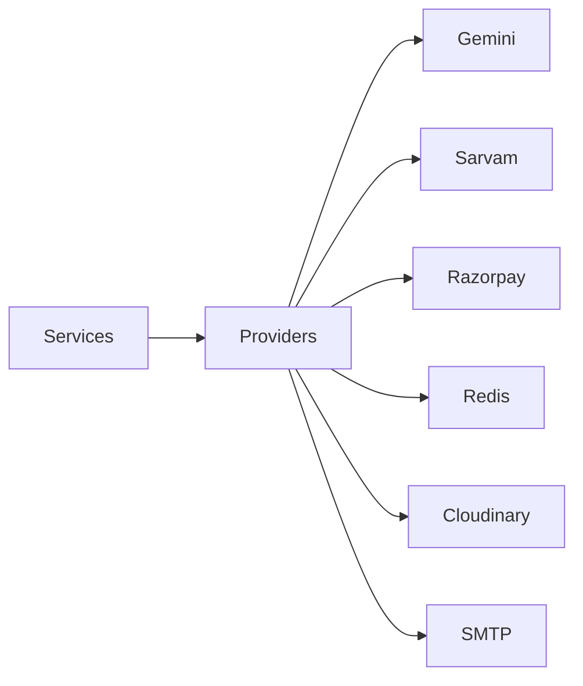
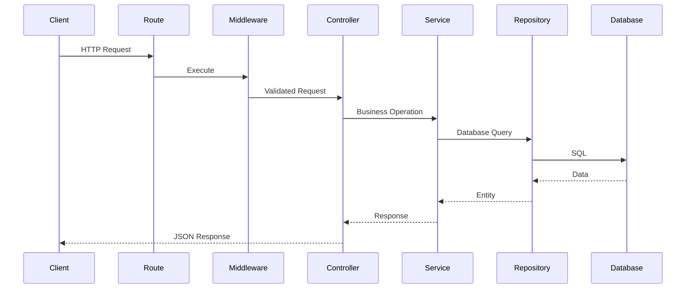

# 9. Backend Architecture

## 9.1 Overview

The BidSense backend is built using a layered architecture with clear separation of concerns. Each layer has a single responsibility, making the application easier to understand, test, maintain, and extend.

The backend is designed around the following architectural patterns:

* Layered Architecture
* Clean Architecture
* Repository Pattern
* Service Layer Pattern
* Provider Pattern
* Dependency Injection (where applicable)
* RESTful API Design

---

# 9.2 Backend Overview

```mermaid
flowchart TB

Client

↓

Express Server

↓

Routes

↓

Middlewares

↓

Controllers

↓

Services

↓

Repositories

↓

Drizzle ORM

↓

PostgreSQL
```

External services are accessed through providers.



---

# 9.3 Backend Directory Structure

```text
backend/
│
├── src/
│
├── config/
├── db/
├── routes/
├── controllers/
├── services/
├── repositories/
├── providers/
├── middlewares/
├── validators/
├── ai/
├── prompts/
├── templates/
├── uploads/
├── utils/
├── docs/
│
├── app.js
└── server.js
```

---

# 9.4 Layer Responsibilities

| Layer      | Responsibility                      |
| ---------- | ----------------------------------- |
| Routes     | API endpoints                       |
| Middleware | Authentication, validation, logging |
| Controller | HTTP request handling               |
| Service    | Business logic                      |
| Repository | Database operations                 |
| Provider   | External services                   |
| Database   | Persistent storage                  |

---

# 9.5 Request Lifecycle

Every request follows the same lifecycle.



---

# 9.6 Route Layer

Purpose:

Expose REST endpoints.

Responsibilities:

* URL definitions
* Middleware registration
* Controller mapping

Example

```javascript
router.post(
    "/register",
    validate(authValidator.register),
    authController.register
);
```

Routes must never contain business logic.

---

# 9.7 Middleware Layer

Responsibilities

* JWT Authentication
* RBAC Authorization
* Request Validation
* File Upload
* Rate Limiting
* Logging
* Error Handling

Execution Order

```text
Request

↓

Logger

↓

Helmet

↓

CORS

↓

Rate Limiter

↓

Authentication

↓

Authorization

↓

Validation

↓

Controller
```

---

# 9.8 Controller Layer

Purpose

Handle HTTP requests.

Responsibilities

* Read request
* Validate request state
* Call service
* Return response

Controllers should remain thin.

Example

```javascript
register(req,res){

const result=await authService.register(req.body)

return ApiResponse.success(res,result)

}
```

Controllers should never:

* Execute SQL
* Call Drizzle directly
* Access Redis
* Call Gemini
* Call Razorpay

---

# 9.9 Service Layer

Purpose

Business logic.

Responsibilities

* Authentication
* Vendor Management
* RFP Workflow
* Proposal Analysis
* AI Processing
* Payment Processing
* Notifications

Services coordinate multiple repositories and providers.

Example

```text
Create Vendor

↓

Check Subscription

↓

Validate Data

↓

Save Vendor

↓

Send Notification

↓

Return Result
```

---

# 9.10 Repository Layer

Purpose

Database abstraction.

Responsibilities

* CRUD
* Transactions
* Query Optimization
* Drizzle Queries

Repositories never contain business logic.

Example

```javascript
findByEmail()

findById()

create()

update()

delete()
```

---

# 9.11 Provider Layer

Purpose

Integrate third-party services.

Supported Providers

AI

* Gemini
* Sarvam

Payments

* Razorpay

Storage

* Cloudinary
* Local Storage

Email

* SMTP
* Nodemailer

Providers isolate SDK implementations.

---

# 9.12 AI Layer

Responsibilities

* Prompt Construction
* RAG
* Embeddings
* Vector Search
* AI Providers
* Memory
* Response Parsing

Structure

```text
ai/

providers/

rag/

chunking/

embeddings/

memory/

pipelines/

parsers/

prompts/
```

---

# 9.13 Database Layer

Technology

* PostgreSQL
* Drizzle ORM

Responsibilities

* Schema
* Relations
* Migrations
* Seed Data

Drizzle is the only component allowed to communicate with PostgreSQL.

---

# 9.14 Cache Layer

Technology

Redis

Stores

* OTP
* Sessions
* Cache
* Dashboard Data
* AI Context
* Rate Limits

Repositories never access Redis directly.

Redis is accessed through dedicated services.

---

# 9.15 Payment Layer

Flow

```mermaid
flowchart LR

Controller

↓

Payment Service

↓

Razorpay Provider

↓

Webhook

↓

Repository

↓

Database
```

Responsibilities

* Orders
* Verification
* Subscription
* Invoice
* Refund

---

# 9.16 AI Request Flow

```mermaid
flowchart TB

User

↓

AI Controller

↓

AI Service

↓

Prompt Builder

↓

Retriever

↓

Qdrant

↓

Gemini

↓

Parser

↓

Response
```

---

# 9.17 File Upload Flow

```mermaid
flowchart TB

Upload

↓

Validation

↓

Storage

↓

Metadata

↓

Parser

↓

Chunking

↓

Embeddings

↓

Qdrant

↓

Database
```

---

# 9.18 Dependency Rules

Allowed dependencies:

```text
Routes

↓

Controllers

↓

Services

↓

Repositories

↓

Database
```

Services may also access:

* Providers
* Redis
* AI
* Storage

Controllers must never access:

* Database
* Redis
* AI Providers
* Payment Providers

Repositories must never access:

* Controllers
* Services
* Providers

These rules prevent circular dependencies.

---

# 9.19 Error Handling

Every layer returns standardized errors.

```text
Repository

↓

Service

↓

Controller

↓

Global Error Middleware

↓

Client
```

Error Types

* Validation Error
* Authentication Error
* Authorization Error
* Business Error
* Database Error
* External API Error
* Payment Error
* AI Error

---

# 9.20 Logging

Every request generates logs.

Categories

* API Logs
* Database Logs
* AI Logs
* Payment Logs
* Authentication Logs
* Audit Logs

Sensitive information such as passwords, tokens, OTPs, and API keys must never be logged.

---

# 9.21 Backend Design Principles

The backend follows these architectural principles:

* Single Responsibility Principle
* Open/Closed Principle
* Dependency Inversion Principle
* Modular Design
* Clean Architecture
* RESTful APIs
* Provider Pattern
* Repository Pattern
* Service Layer Pattern

---

# 9.22 Layer Responsibilities Summary

| Layer      | Responsibility         |
| ---------- | ---------------------- |
| Route      | Endpoint definition    |
| Middleware | Cross-cutting concerns |
| Controller | HTTP communication     |
| Service    | Business logic         |
| Repository | Database access        |
| Provider   | External services      |
| Database   | Data persistence       |
| Redis      | Cache                  |
| Qdrant     | Vector search          |
| AI         | Intelligent processing |

---

# 9.23 Summary

The BidSense backend architecture enforces strict separation between HTTP handling, business logic, persistence, and third-party integrations. Controllers remain lightweight, services orchestrate workflows, repositories encapsulate Drizzle ORM queries, and providers isolate external systems such as Gemini, Sarvam AI, Razorpay, Redis, and Cloudinary. This structure improves maintainability, testability, and scalability while providing a solid foundation for enterprise procurement workflows and AI-powered features.
a