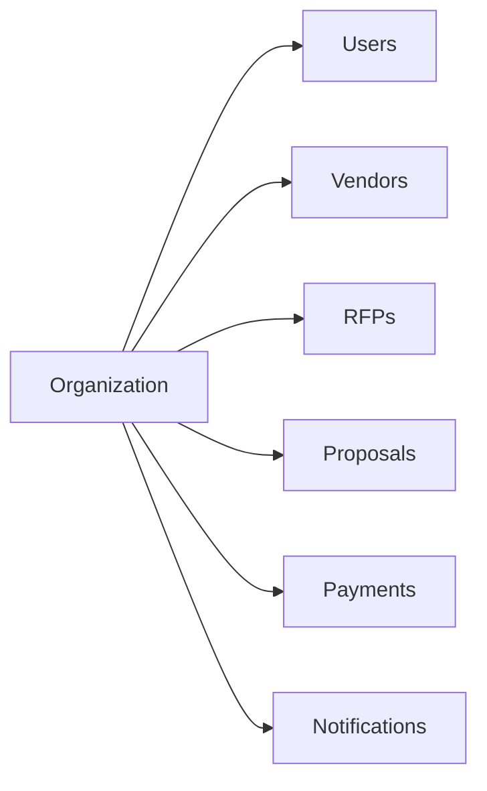
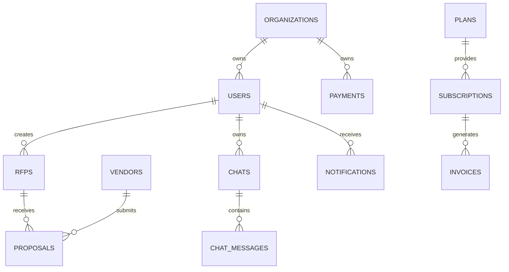

# 7. Database Architecture

## 7.1 Overview

The BidSense platform uses PostgreSQL as the primary relational database and Drizzle ORM as the data access layer.

The database is designed to support enterprise procurement workflows while maintaining data integrity, scalability, and high performance.

The architecture follows a relational model with carefully designed foreign key relationships, indexes, constraints, and transaction boundaries.

---

# 7.2 Database Technology

| Component       | Technology      |
| --------------- | --------------- |
| Database        | PostgreSQL      |
| ORM             | Drizzle ORM     |
| Migration Tool  | Drizzle Kit     |
| Connection Pool | PostgreSQL Pool |
| Cache           | Redis           |
| Vector Database | Qdrant          |

---

# 7.3 Database Design Principles

The database follows these principles:

* Third Normal Form (3NF)
* ACID Transactions
* Referential Integrity
* Optimized Indexing
* Soft Delete Strategy
* Auditability
* Multi-Tenant Isolation
* UUID Primary Keys
* Immutable Audit Logs

---

# 7.4 Multi-Tenant Architecture

BidSense is designed as a multi-tenant SaaS platform.

Each organization has isolated data.



Every business table contains an `organization_id` foreign key.

This ensures:

* Data isolation
* Secure access
* Simple authorization
* Easy scalability

---

# 7.5 Entity Overview

Core entities include:

* Organizations
* Users
* Roles
* Permissions
* Vendors
* Vendor Categories
* RFPs
* RFP Sections
* Proposals
* Proposal Files
* Proposal Scores
* Documents
* Chat Sessions
* Chat Messages
* Notifications
* Activities
* Payments
* Plans
* Subscriptions
* Invoices
* Audit Logs
* Refresh Tokens
* OTP Records

---

# 7.6 High-Level ER Diagram



---

# 7.7 Primary Tables

### Authentication

* organizations
* users
* refresh_tokens
* otp_codes
* roles
* permissions

---

### Procurement

* vendors
* vendor_categories
* rfps
* rfp_sections
* proposals
* proposal_files
* proposal_scores

---

### AI

* documents
* document_chunks
* chat_sessions
* chat_messages

---

### SaaS

* plans
* subscriptions
* payments
* invoices

---

### System

* notifications
* audit_logs
* activities

---

# 7.8 Primary Key Strategy

Every table uses UUIDs.

Example

```text
usr_********

org_********

rfp_********

ven_********

pay_********
```

Advantages:

* Globally unique
* No collision
* Better for distributed systems
* Safer public identifiers

---

# 7.9 Foreign Keys

Every relationship is enforced using foreign keys.

Example

```text
organization_id

user_id

vendor_id

rfp_id

proposal_id

payment_id
```

This prevents orphaned records and maintains referential integrity.

---

# 7.10 Transactions

Database transactions are required for:

* User Registration
* Subscription Purchase
* Payment Verification
* Proposal Submission
* Vendor Invitation
* AI Credit Deduction

All critical operations must either complete successfully or roll back entirely.

---

# 7.11 Indexing Strategy

Indexes are created for:

* Email
* Organization ID
* Vendor Name
* RFP Status
* Proposal Status
* Payment Status
* Created Date
* Updated Date

Composite indexes are used for common query patterns.

Examples:

* `(organization_id, status)`
* `(organization_id, created_at)`
* `(vendor_id, organization_id)`

---

# 7.12 Soft Delete Strategy

Business records are never permanently deleted.

Instead:

```text
deleted_at TIMESTAMP NULL
```

Records remain available for:

* Audit
* Reporting
* Recovery

---

# 7.13 Audit Strategy

Every important action generates an audit record.

Examples:

* Login
* Password Change
* Vendor Creation
* RFP Publication
* Proposal Approval
* Payment Completion

Audit logs are immutable.

---

# 7.14 Database Security

Security measures include:

* Parameterized queries
* Drizzle ORM query builder
* Foreign key constraints
* Unique constraints
* Input validation
* Role-based access
* Organization-level filtering

---

# 7.15 Backup Strategy

Backups include:

* Nightly full backup
* Incremental backups
* Weekly archive
* Point-in-time recovery
* Off-site backup storage

---

# 7.16 Database Responsibilities

PostgreSQL stores:

* Business data
* Authentication
* Payments
* Audit logs
* Metadata
* Application state

Redis stores:

* OTPs
* Sessions
* Cache
* Rate limits

Qdrant stores:

* Embeddings
* Vector indexes
* Semantic search data

This separation ensures that each storage technology is used for the workload it handles best.

---

# 7.17 Summary

The BidSense database architecture is designed to support enterprise-scale procurement workflows with strong consistency, secure multi-tenancy, and efficient query performance. PostgreSQL manages transactional data through Drizzle ORM, Redis accelerates temporary and frequently accessed data, and Qdrant powers AI-driven semantic search and Retrieval-Augmented Generation (RAG). This architecture provides a reliable foundation for both traditional business operations and advanced AI capabilities.
