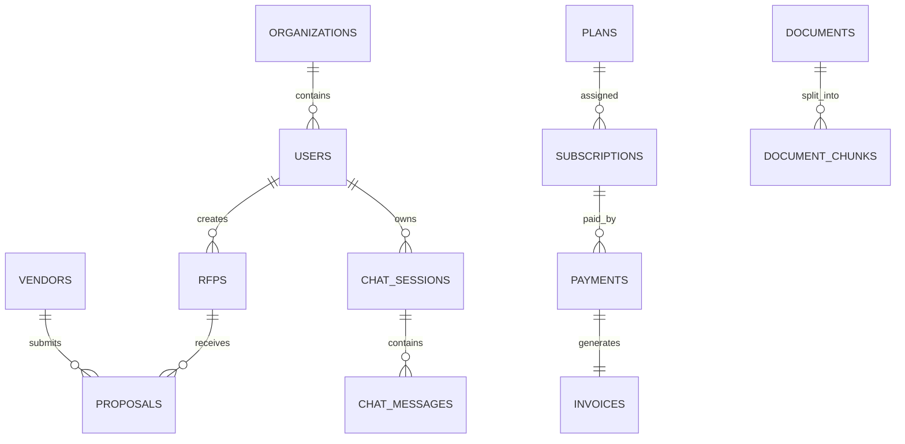

# 8. Database Schema Design

## 8.1 Overview

This chapter defines the complete database schema for BidSense.

The database is implemented using **PostgreSQL** with **Drizzle ORM**.

Every schema is designed using:

* UUID Primary Keys
* Foreign Key Constraints
* Soft Deletes
* Automatic Timestamps
* Optimized Indexes
* Organization Isolation
* ACID Transactions

---

# 8.2 Naming Conventiona

## Tables

```text
snake_case
```

Examples

```text
users
organizations
vendors
rfps
proposal_files
audit_logs
```

---

## Columns

```text
snake_case
```

Examples

```text
first_name

created_at

updated_at

organization_id
```

---

## Drizzle Schema Files

```text
users.schema.js

rfps.schema.js

vendors.schema.js

payments.schema.js
```

---

# 8.3 Common Columns

Almost every table contains the following fields.

| Column          | Type      | Description       |
| --------------- | --------- | ----------------- |
| id              | UUID      | Primary Key       |
| organization_id | UUID      | Tenant Identifier |
| created_at      | Timestamp | Record Creation   |
| updated_at      | Timestamp | Last Update       |
| deleted_at      | Timestamp | Soft Delete       |

---

# 8.4 Organizations Table

## Purpose

Represents companies using BidSense.

### Fields

| Column              | Type      |
| ------------------- | --------- |
| id                  | UUID      |
| name                | TEXT      |
| slug                | TEXT      |
| logo_url            | TEXT      |
| email               | TEXT      |
| phone               | TEXT      |
| website             | TEXT      |
| industry            | TEXT      |
| address             | JSONB     |
| timezone            | TEXT      |
| subscription_status | TEXT      |
| created_at          | TIMESTAMP |
| updated_at          | TIMESTAMP |

### Relationships

```text
Organization

↓

Users

↓

Vendors

↓

RFPs

↓

Payments
```

---

# 8.5 Users Table

## Purpose

Stores all platform users.

### Fields

| Column          | Type      |
| --------------- | --------- |
| id              | UUID      |
| organization_id | UUID      |
| role_id         | UUID      |
| first_name      | TEXT      |
| last_name       | TEXT      |
| email           | TEXT      |
| password        | TEXT      |
| avatar          | TEXT      |
| phone           | TEXT      |
| email_verified  | BOOLEAN   |
| is_active       | BOOLEAN   |
| last_login      | TIMESTAMP |
| created_at      | TIMESTAMP |
| updated_at      | TIMESTAMP |

### Indexes

* email
* organization_id
* role_id

---

# 8.6 Roles Table

Stores predefined roles.

Examples

* Super Admin
* Organization Admin
* Procurement Manager
* Procurement Officer
* Vendor
* Viewer

---

# 8.7 Permissions Table

Stores system permissions.

Examples

```text
vendor.create

vendor.read

vendor.update

vendor.delete

rfp.publish

proposal.review

payment.manage
```

---

# 8.8 Vendors Table

## Purpose

Stores supplier information.

### Fields

| Column          | Type      |
| --------------- | --------- |
| id              | UUID      |
| organization_id | UUID      |
| category_id     | UUID      |
| company_name    | TEXT      |
| contact_name    | TEXT      |
| email           | TEXT      |
| phone           | TEXT      |
| website         | TEXT      |
| address         | JSONB     |
| gst_number      | TEXT      |
| rating          | INTEGER   |
| notes           | TEXT      |
| status          | TEXT      |
| created_at      | TIMESTAMP |
| updated_at      | TIMESTAMP |

---

# 8.9 Vendor Categories

Stores vendor classifications.

Examples

* IT Services
* Construction
* Manufacturing
* Consulting
* Healthcare

---

# 8.10 RFP Table

Stores Request for Proposal information.

### Fields

| Column          | Type      |
| --------------- | --------- |
| id              | UUID      |
| organization_id | UUID      |
| created_by      | UUID      |
| title           | TEXT      |
| description     | TEXT      |
| status          | TEXT      |
| deadline        | TIMESTAMP |
| budget          | DECIMAL   |
| visibility      | TEXT      |
| ai_generated    | BOOLEAN   |
| created_at      | TIMESTAMP |
| updated_at      | TIMESTAMP |

---

# 8.11 RFP Sections

Each RFP consists of multiple sections.

Examples

* Introduction
* Scope
* Eligibility
* Deliverables
* Timeline
* Evaluation Criteria
* Terms & Conditions

---

# 8.12 Proposals

Stores vendor proposals.

### Fields

| Column           | Type      |
| ---------------- | --------- |
| id               | UUID      |
| rfp_id           | UUID      |
| vendor_id        | UUID      |
| submitted_by     | UUID      |
| amount           | DECIMAL   |
| status           | TEXT      |
| ai_score         | INTEGER   |
| risk_score       | INTEGER   |
| compliance_score | INTEGER   |
| submitted_at     | TIMESTAMP |

---

# 8.13 Proposal Files

Stores uploaded proposal documents.

Examples

* PDF
* DOCX
* XLSX
* Images

Metadata includes

* File name
* MIME type
* Size
* Storage path
* Version

---

# 8.14 Documents

Stores AI-processable documents.

Examples

* Contracts
* RFP PDFs
* Vendor Documents
* Technical Specifications

---

# 8.15 Document Chunks

Stores document chunks generated during preprocessing.

Fields

* document_id
* chunk_index
* content
* token_count
* metadata

---

# 8.16 Embeddings

Stores embedding metadata.

Actual vectors are stored in **Qdrant**.

Database stores:

* document_id
* chunk_id
* vector_id
* embedding_model
* created_at

---

# 8.17 Chat Sessions

Stores AI conversations.

Fields

* title
* user_id
* organization_id
* created_at

---

# 8.18 Chat Messages

Stores individual chat messages.

Fields

* session_id
* role
* message
* token_usage
* provider
* created_at

---

# 8.19 Notifications

Stores in-app notifications.

Examples

* Payment Success
* Proposal Submitted
* Vendor Invited
* AI Analysis Complete

---

# 8.20 Activities

Stores timeline events.

Examples

* Login
* Vendor Created
* Proposal Approved
* Subscription Purchased

---

# 8.21 Plans

Subscription plans.

Examples

* Free
* Starter
* Professional
* Enterprise

---

# 8.22 Subscriptions

Stores organization subscriptions.

Fields

* organization_id
* plan_id
* payment_id
* starts_at
* expires_at
* status

---

# 8.23 Payments

Stores Razorpay payment information.

Fields

* razorpay_order_id
* razorpay_payment_id
* amount
* currency
* payment_status
* payment_method
* receipt
* captured_at

---

# 8.24 Invoices

Stores invoice metadata.

Fields

* invoice_number
* organization_id
* payment_id
* total_amount
* tax
* pdf_url
* generated_at

---

# 8.25 Refresh Tokens

Stores refresh token sessions.

Fields

* user_id
* token_hash
* device
* ip_address
* expires_at

---

# 8.26 OTP Table

Stores temporary verification codes.

Fields

* email
* otp
* purpose
* expires_at

---

# 8.27 Audit Logs

Stores immutable audit records.

Examples

* Login
* Password Reset
* Payment Verification
* Vendor Modification
* RFP Publication

---

# 8.28 Files

Stores uploaded file metadata.

Fields

* filename
* original_name
* mime_type
* storage_provider
* size
* uploaded_by

---

# 8.29 Table Relationships



---

# 8.30 Indexing Strategy

Indexes are created for:

* email
* organization_id
* created_at
* status
* vendor_id
* rfp_id
* proposal_id
* payment_status

Composite indexes:

* (organization_id, status)
* (organization_id, created_at)
* (vendor_id, organization_id)
* (rfp_id, status)

---

# 8.31 Soft Delete Strategy

Business tables include:

```text
deleted_at TIMESTAMP NULL
```

Deleted records remain available for:

* Reporting
* Recovery
* Auditing

---

# 8.32 Database Growth Strategy

The schema supports future expansion for:

* Multi-language content
* AI usage tracking
* Multiple payment providers
* ERP integrations
* Government procurement portals
* Workflow automation
* Approval pipelines
* Custom fields

---

# 8.33 Summary

The BidSense database schema is designed for scalability, maintainability, and enterprise procurement workflows. PostgreSQL stores transactional business data, Drizzle ORM provides type-safe schema management and queries, Redis handles temporary and cached data, and Qdrant stores vector embeddings for Retrieval-Augmented Generation (RAG). The schema supports multi-tenancy, secure authentication, AI-powered document analysis, subscription billing, and future platform expansion without major structural changes.
