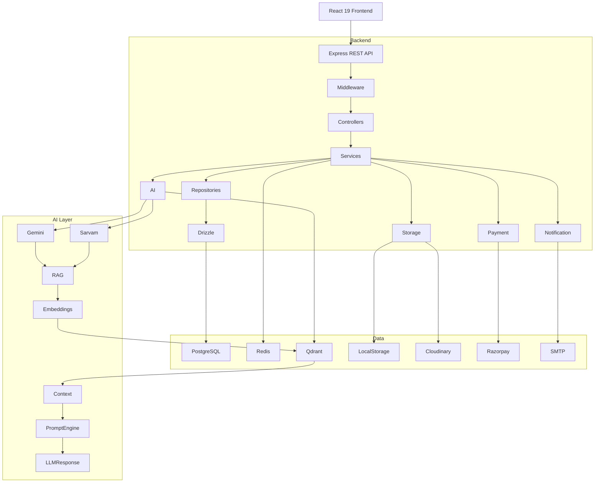
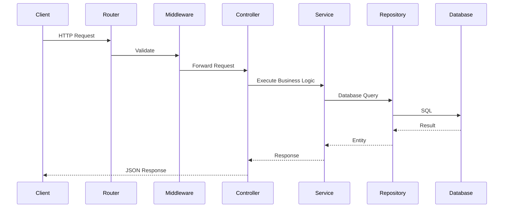
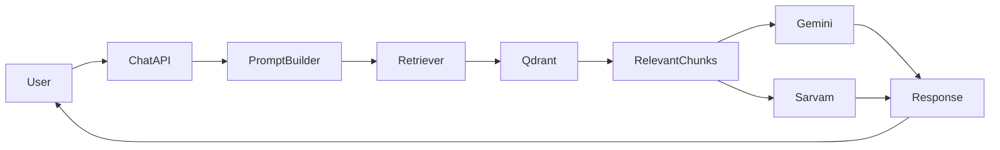

# 4. High-Level System Architecture

## 4.1 Overview

BidSense is designed as a modular, AI-first, cloud-ready Software-as-a-Service (SaaS) platform. The architecture follows a layered approach with clearly separated responsibilities to ensure maintainability, scalability, security, and future extensibility.

The platform integrates traditional procurement workflows with Artificial Intelligence, Retrieval-Augmented Generation (RAG), document processing, and subscription management.

The architecture is designed around the following principles:

* Clean Architecture
* Separation of Concerns
* Modular Services
* Provider Pattern
* Repository Pattern
* API-First Design
* AI-Ready Infrastructure
* Multi-Tenant Support
* Horizontal Scalability

---

# 4.2 Architecture Overview



---

# 4.3 System Components

The platform is divided into multiple independent layers.

## Presentation Layer

Responsible for user interaction.

Technology:

* React 19
* React Router
* Tailwind CSS
* TanStack Query
* React Hook Form
* Axios

Responsibilities:

* User Interface
* Form Validation
* Authentication
* State Management
* API Communication

---

## API Layer

Technology:

* Express.js

Responsibilities:

* Route Management
* Request Parsing
* Authentication
* Authorization
* Validation
* Response Formatting

The API layer acts as the single entry point for all client requests.

---

## Business Layer

The service layer contains all business logic.

Responsibilities:

* Procurement Logic
* Vendor Logic
* AI Orchestration
* Payment Processing
* Notification Processing
* File Processing

No database logic should exist in this layer.

---

## Repository Layer

The repository layer communicates directly with Drizzle ORM.

Responsibilities:

* CRUD Operations
* Query Optimization
* Transactions
* Database Mapping

No business rules should exist in repositories.

---

## Database Layer

Primary Database:

PostgreSQL

ORM:

Drizzle ORM

Stores:

* Users
* Organizations
* Vendors
* RFPs
* Proposals
* Payments
* Notifications
* Audit Logs

---

## Cache Layer

Redis provides temporary storage.

Responsibilities:

* OTP Storage
* Session Cache
* Rate Limiting
* Dashboard Cache
* AI Context Cache
* Frequently Accessed Data

---

## AI Layer

The AI layer abstracts all language model interactions.

Supported Providers:

* Gemini
* Sarvam AI

Future Providers:

* OpenAI
* Claude
* Groq

Responsibilities:

* AI Chat
* Proposal Analysis
* RFP Generation
* Document Summarization
* Compliance Checking
* Vendor Recommendation

---

## Retrieval-Augmented Generation (RAG)

The RAG subsystem enhances AI responses using organization-specific documents.

Responsibilities:

* Document Parsing
* Text Chunking
* Embedding Generation
* Vector Search
* Context Retrieval
* Prompt Construction

---

## Vector Database

Technology:

Qdrant

Responsibilities:

* Store Embeddings
* Similarity Search
* Semantic Retrieval
* Context Ranking

---

## Document Processing Layer

Responsibilities:

* Upload Files
* Parse Documents
* OCR Images
* Generate Metadata
* Extract Tables
* Extract Text
* Generate Embeddings

Supported Formats:

* PDF
* DOCX
* XLSX
* CSV
* TXT
* Images

---

## Payment Layer

Primary Provider:

Razorpay

Responsibilities:

* Subscription Management
* Payment Verification
* Invoice Generation
* Webhook Processing
* Refund Processing

---

## Notification Layer

Responsibilities:

* Email Notifications
* In-App Notifications
* Payment Notifications
* Vendor Invitations
* OTP Emails

---

# 4.4 Request Lifecycle

A standard API request follows the path below.



---

# 4.5 AI Request Flow



---

# 4.6 File Upload Pipeline

```mermaid
flowchart TB

Upload

↓

Validation

↓

Virus Scan

↓

Storage

↓

Parser

↓

Chunking

↓

Embeddings

↓

Qdrant

↓

Metadata

↓

PostgreSQL
```

---

# 4.7 Payment Flow

```mermaid
flowchart LR

User

↓

Subscription

↓

Create Order

↓

Razorpay

↓

Payment

↓

Webhook

↓

Verification

↓

Database

↓

Subscription Activated

↓

Invoice Generated

↓

Notification Sent
```

---

# 4.8 Security Flow

Every protected request follows this sequence:

1. Client sends JWT Access Token.
2. Authentication middleware validates the token.
3. User information is attached to the request.
4. Permission middleware checks required permissions.
5. Request validation executes.
6. Controller processes the request.
7. Response is returned.

Unauthorized requests terminate immediately with an appropriate HTTP status code.

---

# 4.9 External Services

BidSense integrates with the following external systems:

| Service               | Purpose                             |
| --------------------- | ----------------------------------- |
| Gemini                | AI generation and reasoning         |
| Sarvam AI             | Multilingual AI capabilities        |
| Razorpay              | Subscription billing and payments   |
| PostgreSQL            | Primary relational database         |
| Redis                 | Caching and session storage         |
| Qdrant                | Vector database for semantic search |
| Cloudinary (Optional) | Cloud file storage                  |
| SMTP Provider         | Email delivery                      |

---

# 4.10 Architectural Characteristics

| Characteristic     | Strategy                     |
| ------------------ | ---------------------------- |
| Architecture Style | Layered Modular Architecture |
| API Style          | RESTful APIs                 |
| Authentication     | JWT + Refresh Token          |
| Authorization      | RBAC                         |
| ORM                | Drizzle ORM                  |
| Database           | PostgreSQL                   |
| Vector Database    | Qdrant                       |
| Cache              | Redis                        |
| AI Providers       | Gemini + Sarvam              |
| Payment Gateway    | Razorpay                     |
| Storage            | Local + Cloud Compatible     |
| Deployment         | Docker Containers            |
| Scalability        | Horizontal                   |
| Maintainability    | High                         |
| Extensibility      | Provider-Based               |

---

# 4.11 Summary

This architecture separates concerns into dedicated layers while maintaining clear communication paths between components. The modular design allows independent evolution of AI providers, payment gateways, storage solutions, and external integrations without affecting core business logic.

The result is a scalable, maintainable, and production-ready foundation suitable for enterprise procurement workflows and future platform growth.
