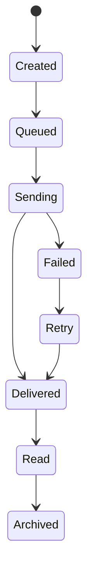

# 21. Notification & Communication Architecture

## 21.1 Overview

The Notification & Communication module delivers real-time and asynchronous communication across the BidSense platform.

Its purpose is to ensure that users receive timely information about procurement activities, AI processing, payment events, proposal updates, and system notifications.

The architecture is event-driven and designed for future scalability.

---

# 21.2 Objectives

The Notification System is designed to:

* Notify users of important events.
* Reduce manual communication.
* Improve collaboration.
* Deliver notifications through multiple channels.
* Track notification delivery.
* Support future messaging platforms.
* Provide user notification preferences.

---

# 21.3 High-Level Architecture

```mermaid
flowchart TB

Business Event

↓

Notification Service

↓

Notification Queue

├── In-App

├── Email

├── SMS (Future)

├── Push Notification (Future)

└── Slack / Teams (Future)

↓

User
```

---

# 21.4 Notification Components

```text
Notification Module

├── Notification Controller
├── Notification Service
├── Notification Repository
├── Email Provider
├── Template Engine
├── Queue Worker
├── Preference Manager
├── Delivery Tracker
└── Notification Scheduler
```

---

# 21.5 Notification Types

### Authentication

* Welcome Email
* Email Verification
* OTP
* Password Reset
* Login Alert

---

### Vendor

* Vendor Invitation
* Vendor Verification
* Vendor Approval
* Vendor Suspension

---

### RFP

* RFP Published
* Amendment Released
* Submission Reminder
* Deadline Reminder
* RFP Closed

---

### Proposal

* Proposal Submitted
* Proposal Updated
* Proposal Shortlisted
* Proposal Rejected
* Proposal Awarded

---

### AI

* AI Analysis Completed
* RFP Generated
* Proposal Review Completed
* Compliance Report Ready

---

### Payments

* Payment Successful
* Payment Failed
* Subscription Activated
* Subscription Expiring
* Invoice Generated

---

### System

* Maintenance Notice
* Security Alert
* New Feature Announcement
* Organization Invitation

---

# 21.6 Notification Channels

Current

| Channel | Status |
| ------- | ------ |
| In-App  | ✅      |
| Email   | ✅      |

Future

| Channel            | Status  |
| ------------------ | ------- |
| SMS                | Planned |
| WhatsApp           | Planned |
| Push Notifications | Planned |
| Microsoft Teams    | Planned |
| Slack              | Planned |

---

# 21.7 Notification Lifecycle



---

# 21.8 Event-Driven Architecture

Every business event publishes a notification event.

Examples

```text
Vendor Created

↓

Vendor Invitation Email

↓

Notification Database

↓

Dashboard Notification
```

Another example

```text
Proposal Submitted

↓

AI Processing Started

↓

Procurement Team Notification

↓

Audit Log
```

---

# 21.9 Email Templates

Supported templates

* Welcome
* Email Verification
* Forgot Password
* Vendor Invitation
* Proposal Received
* Proposal Awarded
* Payment Success
* Invoice
* Subscription Renewal
* Organization Invitation

Templates are version-controlled and reusable.

---

# 21.10 In-App Notifications

Displayed within the application.

Features

* Unread Count
* Mark as Read
* Bulk Read
* Archive
* Delete (Soft Delete)
* Search
* Filters

---

# 21.11 Notification Preferences

Users can configure:

* Email Notifications
* In-App Notifications
* AI Notifications
* Payment Notifications
* Proposal Notifications
* Marketing Emails

Each preference is stored per user.

---

# 21.12 Delivery Queue

Notifications are processed asynchronously.

```mermaid
flowchart LR

Business Event

↓

Queue

↓

Worker

↓

Email Provider

↓

Delivery Status
```

Benefits

* Faster API responses.
* Reliable retries.
* Better scalability.
* Failure isolation.

---

# 21.13 Retry Policy

Retry attempts

| Attempt | Delay      |
| ------- | ---------- |
| First   | Immediate  |
| Second  | 1 Minute   |
| Third   | 5 Minutes  |
| Fourth  | 15 Minutes |

After the final failure:

* Notification marked as Failed.
* Error logged.
* Monitoring alert generated.

---

# 21.14 Notification APIs

| Method | Endpoint                   | Description          |
| ------ | -------------------------- | -------------------- |
| GET    | /notifications             | List notifications   |
| GET    | /notifications/unread      | Unread notifications |
| PATCH  | /notifications/:id/read    | Mark as read         |
| PATCH  | /notifications/read-all    | Mark all as read     |
| DELETE | /notifications/:id         | Archive notification |
| GET    | /notifications/preferences | User preferences     |
| PATCH  | /notifications/preferences | Update preferences   |

---

# 21.15 Database Tables

Core tables

```text
notifications

notification_templates

notification_preferences

notification_delivery_logs

notification_queue
```

---

# 21.16 Business Rules

* Notifications belong to one organization.
* Notifications are immutable after delivery.
* Failed notifications remain in history.
* Users can disable optional notifications.
* Critical security notifications cannot be disabled.

---

# 21.17 Security

Security controls

* Organization isolation
* Permission validation
* Secure email templates
* Audit logging
* Delivery verification
* HTML sanitization

---

# 21.18 Monitoring

Metrics collected

* Notifications Sent
* Delivery Success Rate
* Failed Deliveries
* Queue Length
* Email Open Rate (Future)
* Average Delivery Time
* Retry Count

---

# 21.19 Future Enhancements

Planned improvements

* Real-Time Notifications (WebSocket)
* Push Notifications
* WhatsApp Integration
* SMS Gateway
* Slack Integration
* Microsoft Teams Integration
* Scheduled Notifications
* AI Notification Summaries

---

# 21.20 Complete Notification Flow

```mermaid
flowchart TB

Business Event

↓

Notification Service

↓

Save Database

↓

Queue

↓

Worker

↓

Email Provider

↓

User

↓

Read

↓

Archive
```

---

# 21.21 Summary

The Notification & Communication Architecture provides a centralized, event-driven messaging system for BidSense. It supports reliable multi-channel communication, asynchronous delivery, user preferences, and delivery tracking while remaining extensible for future messaging platforms. By decoupling notification processing from business logic, the platform maintains responsiveness, reliability, and scalability as the number of users and procurement events grows.
a