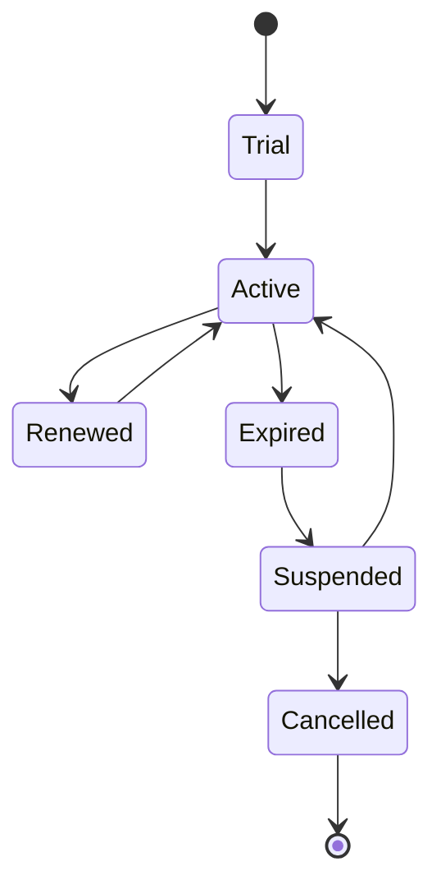
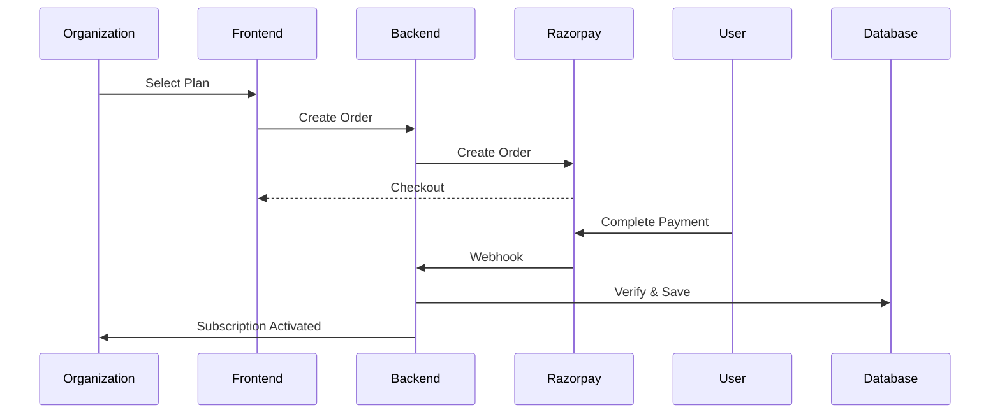

# 20. Payment & Subscription Architecture

## 20.1 Overview

The Payment & Subscription module provides the commercial foundation of the BidSense SaaS platform.

It manages subscription plans, organization billing, payment processing, invoice generation, webhook handling, renewals, refunds, and usage validation.

The module is designed around Razorpay and follows secure payment processing practices while remaining extensible for future payment providers.

---

# 20.2 Objectives

The payment platform is designed to:

* Manage subscription plans.
* Process secure online payments.
* Support recurring billing.
* Generate invoices automatically.
* Verify payment authenticity.
* Handle payment failures gracefully.
* Manage refunds.
* Track payment history.
* Control feature access based on subscription.

---

# 20.3 High-Level Architecture

```mermaid
flowchart TB

Organization

↓

Subscription API

↓

Payment Controller

↓

Payment Service

↓

Razorpay Provider

↓

Razorpay

↓

Webhook

↓

Database

↓

Subscription Activation
```

---

# 20.4 Payment Components

```text
Payment Module

├── Payment Controller

├── Payment Service

├── Subscription Service

├── Invoice Service

├── Razorpay Provider

├── Webhook Handler

├── Payment Repository

├── Invoice Repository

├── Plan Repository

└── Notification Service
```

---

# 20.5 Subscription Plans

The platform supports multiple pricing tiers.

Example

| Plan         | Target Users        |
| ------------ | ------------------- |
| Free         | Small Teams         |
| Starter      | Small Businesses    |
| Professional | Medium Businesses   |
| Enterprise   | Large Organizations |

Each plan defines:

* Monthly Price
* Annual Price
* AI Credits
* Storage
* Team Members
* RFP Limit
* Vendor Limit
* Proposal Limit
* API Access
* Support Level

---

# 20.6 Subscription Lifecycle



---

# 20.7 Payment Flow



---

# 20.8 Order Creation

Steps

1. User selects a subscription.
2. Backend validates the plan.
3. Backend creates a Razorpay Order.
4. Order details are returned.
5. Razorpay Checkout opens.

Database records

* Order ID
* Organization
* Plan
* Amount
* Currency
* Status

---

# 20.9 Payment Verification

Every payment is verified.

Verification includes

* Razorpay Signature
* Payment Status
* Order Matching
* Amount Validation
* Currency Validation

Only verified payments activate subscriptions.

---

# 20.10 Webhook Processing

Webhook events

* payment.captured
* payment.failed
* refund.processed
* subscription.activated
* subscription.cancelled

Webhook processing must be:

* Secure
* Idempotent
* Logged
* Transactional

---

# 20.11 Subscription Activation

After successful payment

* Subscription becomes Active.
* Organization limits are updated.
* AI credits are allocated.
* Invoice is generated.
* Email confirmation is sent.
* Audit log is created.

---

# 20.12 Plan Features

Each subscription controls:

* Maximum Team Members
* Maximum Vendors
* Active RFPs
* Proposal Storage
* AI Requests
* Document Storage
* API Rate Limits
* Priority Support

Feature validation occurs before business operations execute.

---

# 20.13 AI Credit Management

AI usage is quota-based.

Tracked metrics

* Prompt Count
* Token Usage
* Embedding Requests
* Document Analysis
* Proposal Analysis
* RFP Generation

Credits reset at the beginning of each billing cycle.

---

# 20.14 Invoice Generation

Invoices are generated automatically.

Invoice includes

* Invoice Number
* Organization
* Plan
* Billing Period
* Taxes
* GST
* Total Amount
* Payment Status
* Payment Reference

Invoices are stored as PDF.

---

# 20.15 Refund Workflow

```mermaid
flowchart LR

Refund Request

↓

Validation

↓

Razorpay Refund

↓

Webhook

↓

Database Update

↓

Notification
```

Refund history remains permanently available.

---

# 20.16 Failed Payments

Failure scenarios

* Card Declined
* UPI Failure
* Bank Timeout
* Network Failure
* Signature Verification Failure

System actions

* Notify user.
* Keep subscription pending.
* Retry where appropriate.
* Log failure.

---

# 20.17 Billing History

Organizations can access

* Previous Payments
* Current Subscription
* Invoices
* Refunds
* Payment Attempts
* Renewal Dates

---

# 20.18 Subscription Renewal

Renewal process

```mermaid
flowchart LR

Subscription Expiring

↓

Reminder

↓

Automatic Renewal

↓

Payment Success

↓

Subscription Updated
```

If renewal fails

* Reminder emails are sent.
* Grace period begins.
* Features may be restricted after expiration.

---

# 20.19 Payment APIs

| Method | Endpoint               | Description             |
| ------ | ---------------------- | ----------------------- |
| GET    | /plans                 | List subscription plans |
| POST   | /payments/orders       | Create Razorpay order   |
| POST   | /payments/verify       | Verify payment          |
| POST   | /payments/webhook      | Razorpay webhook        |
| GET    | /subscriptions/current | Current subscription    |
| PATCH  | /subscriptions/cancel  | Cancel subscription     |
| GET    | /payments/history      | Payment history         |
| GET    | /invoices              | Invoice list            |
| GET    | /invoices/:id          | Invoice details         |
| POST   | /payments/refund       | Create refund           |

---

# 20.20 Database Tables

Core tables

```text
plans

subscriptions

payments

payment_attempts

refunds

invoices

billing_addresses

usage_metrics
```

---

# 20.21 Business Rules

* One active subscription per organization.
* Payments must be verified before activation.
* Subscription limits apply immediately.
* Invoices are immutable after generation.
* Refunds require payment verification.
* Payment history cannot be deleted.
* Trial plans cannot be renewed.

---

# 20.22 Security

Security measures

* Razorpay Signature Verification
* HTTPS Only
* Secure Webhooks
* Audit Logging
* Idempotent Processing
* Organization Isolation
* Encrypted Secrets
* Payment Validation

No card or banking information is stored by BidSense.

---

# 20.23 Monitoring

Metrics collected

* Monthly Revenue
* Annual Revenue
* Active Subscriptions
* Churn Rate
* Failed Payments
* Refund Count
* AI Credit Consumption
* Average Revenue Per Organization (ARPO)
* Payment Success Rate

---

# 20.24 Future Enhancements

Planned improvements

* Multiple Payment Gateways
* International Payments
* Promo Codes
* Coupon Management
* Team Billing
* Usage-Based Billing
* AI Credit Top-Ups
* Enterprise Contracts
* GST Reports
* Multi-Currency Support

---

# 20.25 Integration Points

The Payment module integrates with

* Authentication
* Organization Management
* AI Usage Tracking
* Notification Service
* Dashboard
* Audit Logs
* Invoice Generator
* Reporting

---

# 20.26 Complete Billing Workflow

```mermaid
flowchart TB

Select Plan

↓

Create Razorpay Order

↓

Complete Payment

↓

Verify Signature

↓

Store Payment

↓

Activate Subscription

↓

Allocate AI Credits

↓

Generate Invoice

↓

Send Email

↓

Audit Log

↓

Dashboard Update
```

---

# 20.27 Summary

The Payment & Subscription Architecture provides a secure and extensible billing platform for BidSense. Razorpay manages payment processing, while the backend validates transactions, activates subscriptions, allocates AI resources, generates invoices, and maintains complete audit records. The modular design supports future payment providers, advanced billing models, and enterprise subscription workflows while ensuring reliable and secure financial operations.
a