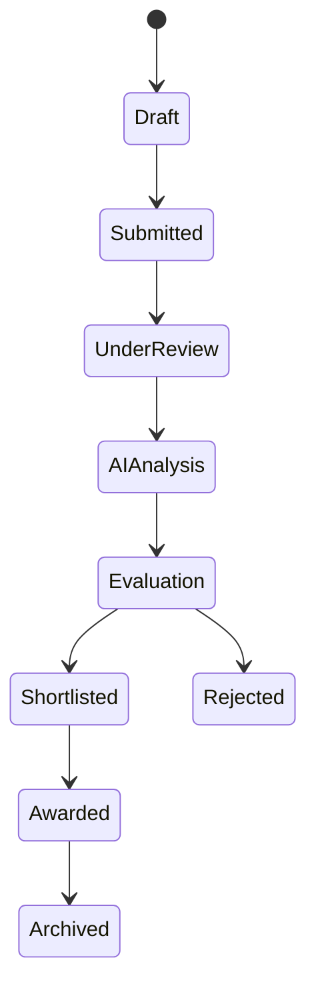

# 19. Proposal Management Architecture

## 19.1 Overview

The Proposal Management module manages the complete lifecycle of vendor proposals submitted in response to an RFP.

It enables vendors to securely submit proposals, procurement teams to review and evaluate submissions, AI to analyze proposal quality, and decision-makers to compare vendors before awarding contracts.

This module is tightly integrated with:

* Vendor Management
* RFP Management
* AI Engine
* RAG
* Document Processing
* Notifications
* Audit Logs

---

# 19.2 Objectives

The Proposal module is designed to:

* Simplify proposal submission.
* Secure proposal documents.
* Automate proposal analysis.
* Compare multiple proposals.
* Score proposals consistently.
* Detect risks and compliance issues.
* Support procurement decisions.
* Maintain complete audit history.

---

# 19.3 High-Level Architecture

```mermaid
flowchart TB

Vendor

↓

Proposal API

↓

Proposal Controller

↓

Proposal Service

↓

Repositories

↓

PostgreSQL

↓

AI Analysis

↓

Evaluation

↓

Award Decision
```

---

# 19.4 Proposal Lifecycle



---

# 19.5 Proposal Creation

A proposal belongs to exactly:

* One Organization
* One RFP
* One Vendor

Each proposal includes:

* Proposal Details
* Commercial Bid
* Technical Bid
* Supporting Documents
* AI Analysis
* Evaluation Scores

---

# 19.6 Proposal Structure

Every proposal contains the following sections.

### Basic Information

* Proposal Title
* Vendor
* RFP
* Submitted By
* Submission Date

---

### Technical Proposal

* Executive Summary
* Technical Solution
* Architecture
* Methodology
* Team
* Timeline

---

### Commercial Proposal

* Pricing
* Taxes
* Payment Terms
* Cost Breakdown

---

### Supporting Documents

* Technical Documents
* Certifications
* Licenses
* Portfolio
* Financial Statements

---

# 19.7 Submission Workflow

```mermaid
flowchart LR

Vendor

↓

Upload Proposal

↓

Validate

↓

Store Files

↓

AI Processing

↓

Submission Complete
```

After submission

* Proposal becomes read-only.
* Vendor receives confirmation.
* Procurement team receives notification.
* AI processing begins.

---

# 19.8 Document Processing

Every uploaded proposal passes through

```text
Upload

↓

Validation

↓

Metadata Extraction

↓

Text Extraction

↓

Chunking

↓

Embedding

↓

Qdrant

↓

AI Analysis
```

---

# 19.9 AI Proposal Analysis

The AI automatically evaluates

* Proposal Completeness
* Technical Quality
* Commercial Competitiveness
* Compliance
* Risks
* Missing Documents
* Timeline Feasibility
* Innovation

---

# 19.10 AI Scores

Multiple scores are generated.

| Score            | Description            |
| ---------------- | ---------------------- |
| Technical Score  | Technical quality      |
| Commercial Score | Pricing evaluation     |
| Compliance Score | Requirement compliance |
| Risk Score       | Procurement risks      |
| Overall Score    | Weighted score         |
| Confidence       | AI confidence          |

---

# 19.11 Proposal Comparison

Procurement teams can compare multiple proposals.

Comparison criteria

* Cost
* Timeline
* Technical Solution
* Experience
* Compliance
* AI Score
* Vendor Rating
* Risk

---

# 19.12 Evaluation Workflow

```mermaid
flowchart TB

Submitted

↓

AI Analysis

↓

Human Review

↓

Committee Review

↓

Final Score

↓

Award Recommendation
```

Human reviewers can override AI recommendations.

---

# 19.13 Scoring Model

Example scoring weights

| Category          | Weight |
| ----------------- | ------ |
| Technical         | 40%    |
| Commercial        | 30%    |
| Compliance        | 15%    |
| Vendor Experience | 10%    |
| AI Risk           | 5%     |

Organizations may configure custom scoring models.

---

# 19.14 Proposal Dashboard

Displays

* Submitted Proposals
* Pending Reviews
* AI Analysis Status
* Shortlisted Vendors
* Proposal Scores
* Evaluation Progress

---

# 19.15 Proposal Status

Possible states

```text
Draft

Submitted

Under Review

AI Analysis

Shortlisted

Rejected

Awarded

Archived
```

---

# 19.16 Notifications

Events include

* Proposal Submitted
* Proposal Updated
* AI Analysis Completed
* Evaluation Started
* Proposal Shortlisted
* Proposal Rejected
* Contract Awarded

---

# 19.17 APIs

| Method | Endpoint                 | Description           |
| ------ | ------------------------ | --------------------- |
| GET    | /proposals               | List proposals        |
| POST   | /proposals               | Submit proposal       |
| GET    | /proposals/:id           | Proposal details      |
| PATCH  | /proposals/:id           | Update draft proposal |
| DELETE | /proposals/:id           | Archive proposal      |
| POST   | /proposals/:id/analyze   | AI analysis           |
| POST   | /proposals/:id/compare   | Compare proposals     |
| POST   | /proposals/:id/shortlist | Shortlist proposal    |
| POST   | /proposals/:id/award     | Award proposal        |

---

# 19.18 Database Tables

Primary tables

```text
proposals

proposal_files

proposal_scores

proposal_reviews

proposal_comments

proposal_versions

proposal_ai_reports
```

---

# 19.19 Business Rules

* One vendor can submit only one proposal per RFP unless multiple submissions are explicitly allowed.
* Draft proposals are editable.
* Submitted proposals become immutable.
* Late submissions are rejected automatically.
* AI analysis starts only after successful submission.
* Deleted proposals are archived rather than permanently removed.
* Awarded proposals cannot be modified.

---

# 19.20 Security

The Proposal module enforces

* Organization isolation
* Vendor ownership validation
* RBAC
* Secure document storage
* Audit logging
* File validation
* Version tracking

---

# 19.21 Performance

Optimization includes

* Background AI analysis
* Parallel document parsing
* Cached proposal summaries
* Lazy loading for large documents
* Incremental comparison
* Streaming AI responses

---

# 19.22 Integration Points

The Proposal module integrates with

* Vendor Module
* RFP Module
* AI Module
* RAG Engine
* Document Processing
* Notification Service
* Payment Module (Future)
* Audit Logs

---

# 19.23 Complete Proposal Workflow

```mermaid
flowchart TB

Vendor Login

↓

Select RFP

↓

Create Proposal

↓

Upload Documents

↓

Submit

↓

Document Processing

↓

RAG Indexing

↓

AI Analysis

↓

Human Review

↓

Evaluation

↓

Shortlist

↓

Award

↓

Archive
```

---

# 19.24 Future Enhancements

Planned capabilities

* Collaborative proposal drafting
* Proposal templates
* AI proposal writing assistant
* Real-time procurement chat
* Digital signatures
* Bid withdrawal workflow
* Automatic plagiarism detection
* Proposal quality benchmarking
* AI-generated executive summaries

---

# 19.25 Summary

The Proposal Management Architecture provides an end-to-end workflow for receiving, processing, evaluating, and awarding vendor proposals. It combines secure document handling, AI-powered analysis, configurable evaluation models, and procurement workflows into a unified system. Through integration with the RAG pipeline and AI services, BidSense delivers faster, more consistent, and data-driven proposal evaluation while maintaining transparency, auditability, and enterprise-grade security.
a