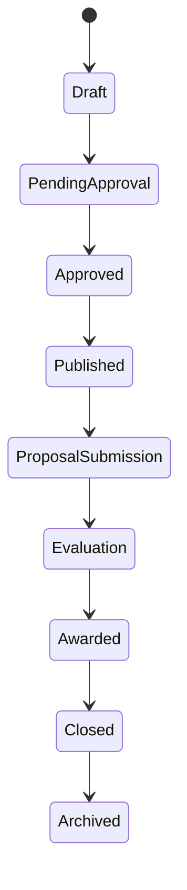

# 18. RFP Management Architecture

## 18.1 Overview

The Request for Proposal (RFP) module is the core business module of BidSense.

It enables organizations to create, manage, publish, distribute, evaluate, and archive procurement requests while leveraging Artificial Intelligence to automate drafting, compliance validation, vendor selection, and proposal evaluation.

The module is designed to support both simple procurement requests and complex enterprise procurement workflows.

---

# 18.2 Objectives

The RFP module is designed to:

* Create standardized procurement requests.
* Reduce manual work using AI.
* Manage complete RFP lifecycles.
* Invite qualified vendors.
* Support approval workflows.
* Track procurement progress.
* Maintain complete version history.
* Improve procurement transparency.

---

# 18.3 High-Level Architecture

```mermaid
flowchart TB

Procurement Team

↓

RFP API

↓

RFP Controller

↓

RFP Service

↓

Repositories

↓

PostgreSQL

↓

AI Engine

↓

Notifications

↓

Vendor Portal
```

---

# 18.4 RFP Lifecycle



---

# 18.5 RFP Creation

An RFP can be created using:

* Manual Creation
* AI-Assisted Creation
* Existing Template
* Duplicate Previous RFP

The system automatically assigns:

* Organization
* Creator
* Version
* Status
* Created Timestamp

---

# 18.6 RFP Information

Every RFP contains:

## Basic Information

* Title
* Description
* Procurement Type
* Department
* Category
* Budget
* Currency

---

## Project Information

* Scope
* Objectives
* Deliverables
* Timeline
* Milestones
* Success Criteria

---

## Commercial Information

* Estimated Budget
* Payment Terms
* Taxes
* Currency
* Pricing Model

---

## Procurement Information

* Procurement Method
* Submission Deadline
* Evaluation Deadline
* Award Date
* Project Start Date

---

## Vendor Requirements

* Required Certifications
* Experience
* Team Size
* Technical Skills
* Financial Eligibility

---

# 18.7 AI RFP Generation

AI can generate:

* Executive Summary
* Project Background
* Objectives
* Scope
* Deliverables
* Technical Requirements
* Functional Requirements
* Timeline
* Budget Recommendations
* Evaluation Criteria
* Terms & Conditions

The generated draft is editable before publication.

---

# 18.8 RFP Sections

Each RFP is composed of structured sections.

Examples

* Introduction
* Background
* Scope
* Objectives
* Deliverables
* Functional Requirements
* Technical Requirements
* Timeline
* Budget
* Vendor Eligibility
* Evaluation Criteria
* Submission Instructions
* Terms & Conditions
* Legal Requirements
* Appendices

Each section can be reordered, edited, enabled, or disabled.

---

# 18.9 Version Management

Every significant modification creates a new version.

```text
Version 1

↓

Version 2

↓

Version 3

↓

Version 4
```

Version history stores:

* Editor
* Change Summary
* Timestamp
* Previous Version

Administrators can compare any two versions.

---

# 18.10 Approval Workflow

Organizations can configure approval workflows.

Example

```mermaid
flowchart LR

Draft

↓

Manager Approval

↓

Finance Approval

↓

Legal Approval

↓

Published
```

Approval steps are configurable.

---

# 18.11 Publishing

Publishing performs the following:

* Locks approved content.
* Generates public identifiers.
* Sends vendor invitations.
* Starts proposal submission period.
* Creates audit logs.
* Schedules notifications.

---

# 18.12 Vendor Invitation

Vendors can be selected using:

* Manual Selection
* AI Recommendation
* Previous Vendors
* Category Filters

Invitation channels

* Email
* In-App Notification

Future

* Vendor Portal
* API Integration

---

# 18.13 Proposal Submission Window

Configuration

* Start Date
* End Date
* Grace Period
* Maximum File Size
* Maximum Proposal Count

After the deadline:

* New submissions are rejected.
* Existing submissions remain accessible for evaluation.

---

# 18.14 Amendments

Organizations may issue amendments.

Examples

* Deadline Extension
* Budget Change
* Scope Change
* New Requirements
* Clarifications

Every amendment is versioned and communicated to invited vendors.

---

# 18.15 Evaluation Criteria

Criteria may include:

* Technical Score
* Commercial Score
* Vendor Experience
* Compliance
* Delivery Timeline
* AI Score
* Risk Score

Weights are configurable.

Example

| Criterion  | Weight |
| ---------- | ------ |
| Technical  | 40%    |
| Commercial | 30%    |
| Compliance | 15%    |
| Experience | 10%    |
| AI Risk    | 5%     |

---

# 18.16 RFP Dashboard

Displays

* Draft RFPs
* Published RFPs
* Active Procurement
* Closing Soon
* Proposal Count
* Vendor Count
* Evaluation Progress

---

# 18.17 AI Features

AI assists throughout the RFP lifecycle.

Capabilities

* Generate complete RFPs.
* Improve writing quality.
* Detect missing sections.
* Recommend evaluation criteria.
* Estimate procurement risks.
* Suggest qualified vendors.
* Summarize procurement documents.
* Answer procurement questions.

---

# 18.18 Notifications

System notifications include:

* RFP Created
* RFP Published
* Vendor Invited
* Deadline Reminder
* Amendment Issued
* Proposal Received
* Evaluation Started
* Award Completed

---

# 18.19 APIs

| Method | Endpoint                 | Description       |
| ------ | ------------------------ | ----------------- |
| GET    | /rfps                    | List RFPs         |
| POST   | /rfps                    | Create RFP        |
| GET    | /rfps/:id                | Get RFP           |
| PATCH  | /rfps/:id                | Update RFP        |
| DELETE | /rfps/:id                | Archive RFP       |
| POST   | /rfps/:id/publish        | Publish           |
| POST   | /rfps/:id/duplicate      | Duplicate         |
| POST   | /rfps/:id/amendments     | Create Amendment  |
| POST   | /rfps/:id/invite-vendors | Invite Vendors    |
| POST   | /rfps/:id/generate-ai    | Generate AI Draft |
| GET    | /rfps/:id/versions       | Version History   |

---

# 18.20 Database Tables

Core tables

```text
rfps

rfp_sections

rfp_versions

rfp_amendments

rfp_vendors

rfp_documents

rfp_templates

rfp_approvals
```

---

# 18.21 Business Rules

* Every RFP belongs to one organization.
* Only Draft RFPs are editable.
* Published RFPs require amendments for changes.
* Archived RFPs cannot receive proposals.
* Deadlines cannot be set in the past.
* Vendors must belong to the same organization.
* Approval is required before publishing (if workflow enabled).

---

# 18.22 Security

Security controls include:

* Organization isolation
* RBAC
* Approval permissions
* Audit logging
* Input validation
* Document access control
* Version protection

---

# 18.23 Monitoring

Metrics collected

* Total RFPs
* Published RFPs
* Active RFPs
* Average Procurement Time
* Proposal Count
* Vendor Participation Rate
* AI Usage
* Amendment Count
* Approval Time

---

# 18.24 Future Enhancements

Planned improvements

* RFP Templates Marketplace
* AI Auto-Approval Suggestions
* Collaborative Editing
* Real-Time Comments
* Procurement Calendar
* Government Tender Import
* ERP Integration
* Workflow Builder
* Digital Signatures

---

# 18.25 Complete RFP Workflow

```mermaid
flowchart TB

Create RFP

↓

AI Draft (Optional)

↓

Edit Sections

↓

Approval Workflow

↓

Publish

↓

Invite Vendors

↓

Receive Proposals

↓

AI Analysis

↓

Evaluation

↓

Award Vendor

↓

Close Procurement

↓

Archive
```

---

# 18.26 Summary

The RFP Management Architecture provides a complete procurement lifecycle from drafting to archival. It combines structured workflows, configurable approvals, AI-assisted content generation, version control, vendor invitations, and automated notifications into a unified module. By integrating tightly with the AI, document processing, proposal management, and notification systems, the RFP module becomes the operational center of the BidSense procurement platform.
a