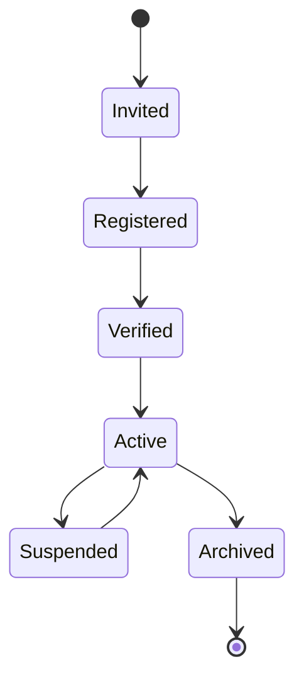
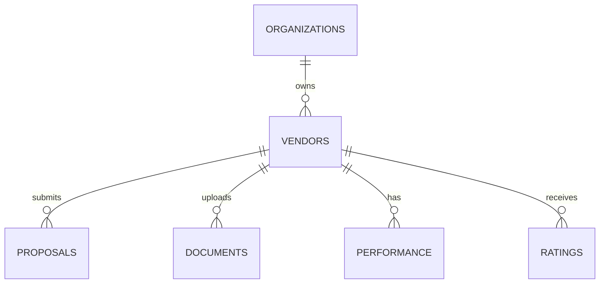

# 17. Vendor Management Architecture

## 17.1 Overview

The Vendor Management module is responsible for maintaining the complete lifecycle of suppliers within BidSense.

It enables procurement teams to register, categorize, evaluate, communicate with, and monitor vendors while maintaining historical performance data and procurement relationships.

The module serves as the foundation for vendor selection, proposal submission, AI recommendations, and procurement analytics.

---

# 17.2 Objectives

The Vendor Management module is designed to:

* Centralize vendor information.
* Manage vendor lifecycle.
* Track vendor performance.
* Support vendor onboarding.
* Organize vendors by categories.
* Enable AI-powered recommendations.
* Maintain procurement history.
* Improve procurement transparency.

---

# 17.3 High-Level Architecture

```mermaid
flowchart TB

Procurement Team

↓

Vendor API

↓

Vendor Controller

↓

Vendor Service

↓

Vendor Repository

↓

Drizzle ORM

↓

PostgreSQL

↓

AI Recommendation Engine
```

---

# 17.4 Vendor Lifecycle



---

# 17.5 Vendor Registration

A vendor can be added by:

* Procurement Administrator
* Organization Administrator
* Vendor Invitation
* Future Self Registration

Registration includes

* Company Details
* Contact Details
* Address
* GST Number
* PAN Number
* Industry
* Certifications
* Documents

---

# 17.6 Vendor Profile

Each vendor profile contains

## Basic Information

* Company Name
* Legal Name
* Registration Number
* GST Number
* PAN
* Website
* Email
* Phone

---

## Contact Information

* Primary Contact
* Procurement Contact
* Finance Contact
* Technical Contact

---

## Address

* Country
* State
* City
* Postal Code
* Full Address

---

## Business Information

* Industry
* Categories
* Company Size
* Years of Experience
* Annual Revenue (Optional)
* Certifications

---

# 17.7 Vendor Categories

Examples

* Software
* Hardware
* Cloud Services
* Consulting
* Construction
* Manufacturing
* Healthcare
* Education
* Logistics
* Security

A vendor may belong to multiple categories.

---

# 17.8 Vendor Documents

Supported documents

* Company Registration
* GST Certificate
* PAN
* ISO Certificates
* Compliance Certificates
* Insurance
* NDA
* Financial Statements
* Portfolio

Documents are stored using the document processing pipeline.

---

# 17.9 Vendor Status

Possible states

```text
Pending

Verified

Active

Suspended

Blacklisted

Archived
```

Only Active vendors may participate in procurement activities.

---

# 17.10 Vendor Performance

Performance metrics include

* Total Invitations
* Total RFPs
* Submitted Proposals
* Awarded Projects
* Success Rate
* Average Proposal Score
* AI Risk Score
* Compliance Score
* Response Time

These metrics are continuously updated.

---

# 17.11 Vendor Rating

Ratings combine

* Manual Evaluation
* AI Evaluation
* Historical Performance
* Delivery History
* Compliance
* Procurement Feedback

Overall score

```text
0 — 100
```

---

# 17.12 Vendor Dashboard

Displays

* Active Projects
* Submitted Proposals
* Pending Invitations
* Compliance Status
* Performance Trend
* Recent Activity
* AI Recommendations

---

# 17.13 Vendor Search

Supported filters

* Category
* Industry
* Country
* State
* Rating
* Status
* Experience
* Certifications

Supports

* Full Text Search
* Semantic Search
* AI Search

---

# 17.14 Vendor Recommendation

AI recommends vendors using

* Similar Projects
* Proposal History
* Performance
* Industry
* Technical Expertise
* Budget Compatibility
* Risk Profile
* Compliance History

---

# 17.15 Vendor Invitations

Invitation process

```mermaid
flowchart LR

Create RFP

↓

Select Vendors

↓

Send Invitation

↓

Email Notification

↓

Vendor Portal

↓

Submit Proposal
```

---

# 17.16 Vendor APIs

| Method | Endpoint                 | Description        |
| ------ | ------------------------ | ------------------ |
| GET    | /vendors                 | List vendors       |
| POST   | /vendors                 | Create vendor      |
| GET    | /vendors/:id             | Vendor details     |
| PATCH  | /vendors/:id             | Update vendor      |
| DELETE | /vendors/:id             | Archive vendor     |
| GET    | /vendors/search          | Search vendors     |
| POST   | /vendors/invite          | Invite vendor      |
| GET    | /vendors/:id/performance | Performance report |
| GET    | /vendors/:id/documents   | Vendor documents   |

---

# 17.17 Database Tables

Primary tables

```text
vendors

vendor_categories

vendor_documents

vendor_contacts

vendor_ratings

vendor_performance

vendor_activity
```

Relationships



---

# 17.18 Business Rules

* Vendor email must be unique within an organization.
* Archived vendors cannot receive new invitations.
* Suspended vendors cannot submit proposals.
* Vendor documents require verification before activation.
* Only authorized users may edit vendor information.
* Vendor history cannot be deleted.

---

# 17.19 Security

The Vendor module enforces

* Organization isolation
* RBAC
* Document permissions
* Audit logging
* Secure file access
* Input validation

---

# 17.20 Vendor Processing Flow

```mermaid
flowchart TB

Create Vendor

↓

Validate

↓

Save Database

↓

Upload Documents

↓

AI Classification

↓

Verification

↓

Activate Vendor

↓

Available for Procurement
```

---

# 17.21 Monitoring

Metrics collected

* Vendor Count
* Active Vendors
* Suspended Vendors
* Average Rating
* Proposal Success Rate
* AI Recommendation Accuracy
* Vendor Growth
* Category Distribution

---

# 17.22 Future Enhancements

Future capabilities include

* Vendor Portal
* Vendor Self Registration
* Vendor Verification Workflow
* AI Vendor Scoring
* ESG Scoring
* Government Verification
* ERP Synchronization
* Vendor Risk Intelligence
* Automatic Compliance Monitoring

---

# 17.23 Summary

The Vendor Management Architecture provides a centralized, secure, and scalable system for managing supplier relationships throughout the procurement lifecycle. By combining structured vendor data, AI-driven insights, performance analytics, and document management, BidSense enables procurement teams to identify, evaluate, and collaborate with the most suitable vendors while maintaining a complete audit trail and historical record.
