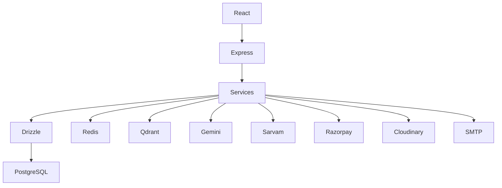

# 5. Technology Stack

## 5.1 Overview

BidSense is built using a modern JavaScript-based technology stack designed for scalability, maintainability, AI integration, and cloud deployment.

The selected technologies emphasize:

* Production readiness
* Strong community support
* Developer productivity
* Modular architecture
* AI-first development
* Horizontal scalability

---

# 5.2 Technology Stack Overview

| Layer                 | Technology                             |
| --------------------- | -------------------------------------- |
| Frontend              | React 19                               |
| Build Tool            | Vite                                   |
| Routing               | React Router 7                         |
| Styling               | Tailwind CSS v4                        |
| State Management      | TanStack Query                         |
| Forms                 | React Hook Form                        |
| Validation (Frontend) | Zod                                    |
| HTTP Client           | Axios                                  |
| Backend               | Express.js                             |
| Runtime               | Node.js (LTS)                          |
| Language              | JavaScript (ES Modules)                |
| ORM                   | Drizzle ORM                            |
| Database              | PostgreSQL                             |
| Cache                 | Redis                                  |
| Vector Database       | Qdrant                                 |
| AI Providers          | Gemini, Sarvam AI                      |
| Payment Gateway       | Razorpay                               |
| Email                 | Nodemailer                             |
| File Upload           | Multer                                 |
| File Storage          | Local Storage / Cloudinary / Amazon S3 |
| Documentation         | Swagger (OpenAPI 3)                    |
| Authentication        | JWT + Refresh Tokens                   |
| Password Hashing      | bcrypt                                 |
| Testing               | Vitest, Supertest                      |
| Containerization      | Docker                                 |
| Reverse Proxy         | Nginx                                  |
| CI/CD                 | GitHub Actions                         |

---

# 5.3 Frontend Technologies

## React 19

Purpose:

* Build the user interface.

Why React?

* Component-based architecture.
* Large ecosystem.
* Strong community support.
* Excellent performance.
* Easy integration with REST APIs.
* Suitable for enterprise applications.

---

## Vite

Purpose:

Development server and build tool.

Why Vite?

* Extremely fast startup.
* Instant Hot Module Replacement (HMR).
* Optimized production builds.
* Native ES Module support.

---

## React Router 7

Purpose:

Client-side routing.

Responsibilities:

* Protected routes.
* Nested layouts.
* Dynamic routing.
* Route parameters.

---

## Tailwind CSS v4

Purpose:

User interface styling.

Why Tailwind?

* Utility-first design.
* Consistent design system.
* Small production bundles.
* Fast development.

---

## TanStack Query

Purpose:

Server-state management.

Responsibilities:

* API caching.
* Background refetching.
* Optimistic updates.
* Request deduplication.
* Automatic retries.

---

## React Hook Form

Purpose:

Form management.

Responsibilities:

* Input registration.
* Validation.
* Error handling.
* Performance optimization.

---

## Zod

Purpose:

Frontend validation.

Responsibilities:

* Type-safe schemas.
* Shared validation rules.
* Form validation.

---

# 5.4 Backend Technologies

## Node.js

Purpose:

Runtime environment.

Why Node.js?

* Excellent asynchronous performance.
* Large package ecosystem.
* Strong community.
* Ideal for API development.
* JavaScript across the entire stack.

---

## Express.js

Purpose:

REST API framework.

Responsibilities:

* Routing.
* Middleware.
* Request handling.
* Response formatting.
* Error handling.

Why Express?

* Lightweight.
* Flexible.
* Stable.
* Large ecosystem.
* Easy customization.

---

# 5.5 Database

## PostgreSQL

Purpose:

Primary relational database.

Stores:

* Users
* Organizations
* Vendors
* RFPs
* Proposals
* Payments
* Notifications
* Audit Logs

Why PostgreSQL?

* ACID compliance.
* High reliability.
* Excellent indexing.
* JSON support.
* Full-text search.
* Enterprise-grade performance.

---

## Drizzle ORM

Purpose:

Database ORM.

Responsibilities:

* Schema definition.
* Migrations.
* Type-safe queries.
* Relationship management.

Why Drizzle?

* Lightweight.
* SQL-first philosophy.
* Excellent performance.
* Minimal abstraction.
* Easy debugging.
* Simple migrations.

---

# 5.6 Cache Layer

## Redis

Purpose:

In-memory data store.

Responsibilities:

* OTP storage.
* Session cache.
* Rate limiting.
* Dashboard cache.
* AI context cache.

Why Redis?

* Extremely fast.
* Supports expiration.
* Ideal for temporary data.
* Widely adopted.

---

# 5.7 AI Stack

## Gemini

Purpose:

Primary Large Language Model.

Responsibilities:

* RFP generation.
* Proposal analysis.
* Compliance checking.
* Summarization.
* AI chat.
* Reasoning.

---

## Sarvam AI

Purpose:

Indian language support.

Responsibilities:

* Translation.
* Regional language understanding.
* Speech capabilities (future).
* Localization.

---

# 5.8 Retrieval-Augmented Generation (RAG)

## Qdrant

Purpose:

Vector database.

Responsibilities:

* Store embeddings.
* Semantic search.
* Context retrieval.
* Similarity search.

Why Qdrant?

* Open source.
* High performance.
* Docker support.
* REST API.
* Optimized for AI applications.

---

# 5.9 File Processing

## Multer

Purpose:

File uploads.

Supported Files:

* PDF
* DOCX
* XLSX
* CSV
* Images

---

## PDF Processing

Libraries:

* pdf-parse
* pdf-lib
* pdfjs
* mammoth (DOCX)

Responsibilities:

* Extract text.
* Generate metadata.
* Feed RAG pipeline.

---

# 5.10 Storage

Development:

* Local Storage

Production:

* Cloudinary
* Amazon S3

Responsibilities:

* Document storage.
* Proposal files.
* User avatars.
* Generated reports.

---

# 5.11 Payment Gateway

## Razorpay

Purpose:

Subscription billing.

Responsibilities:

* Create orders.
* Verify payments.
* Handle webhooks.
* Generate invoices.
* Manage subscriptions.

Why Razorpay?

* Excellent Node.js SDK.
* UPI support.
* Subscription APIs.
* Indian payment ecosystem.

---

# 5.12 Authentication

## JWT

Purpose:

Authentication.

Responsibilities:

* Access Token
* Refresh Token

---

## bcrypt

Purpose:

Password hashing.

Responsibilities:

* Hash passwords.
* Verify passwords.

---

# 5.13 Email

## Nodemailer

Purpose:

Email delivery.

Templates:

* OTP
* Password Reset
* Vendor Invitation
* Invoice
* Payment Confirmation

---

# 5.14 Documentation

## Swagger (OpenAPI)

Purpose:

API documentation.

Benefits:

* Interactive testing.
* API reference.
* Client integration.
* Developer onboarding.

---

# 5.15 Testing

## Vitest

Purpose:

Unit testing.

---

## Supertest

Purpose:

API testing.

Responsibilities:

* Endpoint validation.
* Authentication tests.
* Integration tests.

---

# 5.16 Containerization

## Docker

Purpose:

Containerize the application.

Containers:

* Backend
* PostgreSQL
* Redis
* Qdrant

Benefits:

* Consistent environments.
* Easy deployment.
* Simplified onboarding.

---

# 5.17 Reverse Proxy

## Nginx

Responsibilities:

* HTTPS termination.
* Reverse proxy.
* Load balancing.
* Static asset delivery.
* Compression.

---

# 5.18 CI/CD

## GitHub Actions

Responsibilities:

* Install dependencies.
* Run linting.
* Execute tests.
* Build Docker image.
* Deploy application.

---

# 5.19 Development Tools

| Tool           | Purpose                   |
| -------------- | ------------------------- |
| ESLint         | Code quality              |
| Prettier       | Code formatting           |
| Husky          | Git hooks                 |
| lint-staged    | Pre-commit validation     |
| dotenv         | Environment configuration |
| Nodemon        | Development server        |
| Docker Desktop | Local containers          |

---

# 5.20 Architecture Technology Flow

---

# 5.21 Technology Selection Rationale

| Requirement    | Selected Technology | Reason                                 |
| -------------- | ------------------- | -------------------------------------- |
| UI Development | React 19            | Modern component architecture          |
| Backend API    | Express.js          | Lightweight and flexible               |
| Database       | PostgreSQL          | Reliable relational database           |
| ORM            | Drizzle ORM         | SQL-first, lightweight, performant     |
| Cache          | Redis               | Fast in-memory operations              |
| Vector Search  | Qdrant              | Open-source vector database            |
| AI             | Gemini              | Strong reasoning and document analysis |
| Regional AI    | Sarvam AI           | Indian language support                |
| Payments       | Razorpay            | Best fit for Indian SaaS               |
| Storage        | Cloudinary / S3     | Scalable file storage                  |
| Authentication | JWT                 | Stateless authentication               |
| Containers     | Docker              | Consistent deployments                 |

---

# 5.22 Summary

The BidSense technology stack is designed around modern, production-ready technologies that complement one another. PostgreSQL and Drizzle provide a reliable transactional data layer, Redis accelerates frequently accessed data, Qdrant powers semantic retrieval for the AI subsystem, Gemini and Sarvam deliver intelligent document analysis and multilingual capabilities, and Razorpay enables subscription billing for the SaaS platform. Together, these technologies provide a scalable foundation capable of supporting future enhancements while maintaining a clean and maintainable architecture.
